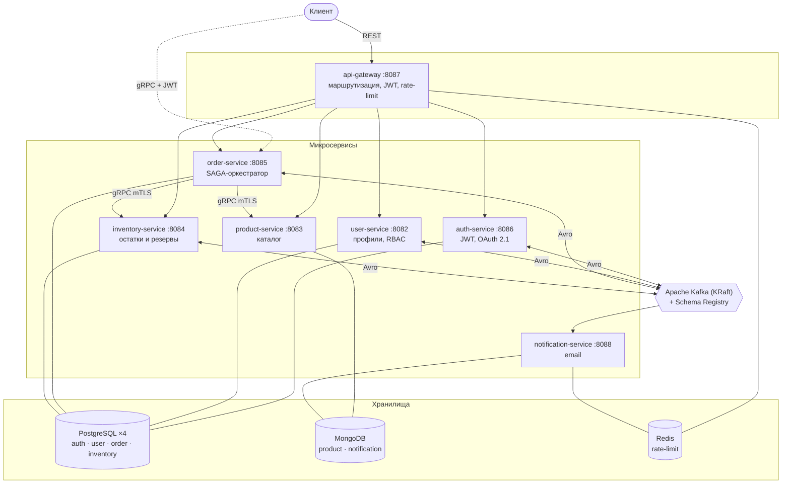
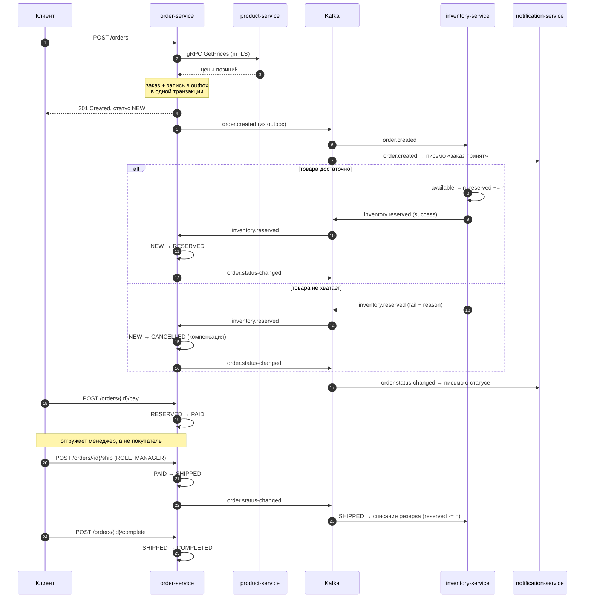

# Event-Driven Order Processing Platform

[](https://github.com/kelis2k/order-processing-platform/actions/workflows/ci.yml)

Платформа обработки заказов для небольшого e-commerce: семь микросервисов на Spring Boot 3,
асинхронный обмен через Apache Kafka с Avro-схемами, распределённая транзакция заказа по паттерну
**SAGA (orchestration)** с компенсацией, синхронные вызовы по gRPC под mTLS.

Учебный проект для портфолио. Фронтенда нет — всё через REST и gRPC API.

---

## Архитектура



| Сервис | Назначение | Хранилище | Протоколы | Порт |
| --- | --- | --- | --- | --- |
| **api-gateway** | единая точка входа, JWT-гейт, rate-limiting | — | REST | 8087 |
| **auth-service** | регистрация, JWT (RS256), OAuth 2.1, JWKS | PostgreSQL | REST | 8086 |
| **user-service** | профили, роли (RBAC) | PostgreSQL | REST, Kafka | 8082 |
| **product-service** | каталог товаров, поиск | MongoDB | REST, gRPC, Kafka | 8083 / 9089 |
| **inventory-service** | остатки, резервирование | PostgreSQL | REST, gRPC, Kafka | 8084 / 9090 |
| **order-service** | жизненный цикл заказа, SAGA, Outbox | PostgreSQL | REST, gRPC, Kafka | 8085 / 9091 |
| **notification-service** | письма о заказах и регистрации | MongoDB | Kafka | 8088 |

**Ключевые решения:** database-per-service (общих БД нет), Outbox для гарантированной публикации
событий, SAGA-orchestration вместо choreography, отдельный gRPC-entrypoint мимо шлюза.
Обоснования — в [ADR](docs/adr).

---

## Жизненный цикл заказа

```
NEW → RESERVED → PAID → SHIPPED → COMPLETED
   ↘ CANCELLED  (компенсация при нехватке товара)
```



Переходы статусов защищены FSM-гардом: недопустимый переход бросает исключение, а не портит данные.
Повторная доставка событий безопасна — и оркестратор, и склад идемпотентны
([ADR 0021](docs/adr/0021-outbox-concurrency-and-reserve-idempotency.md)).

---

## Стек

| Слой | Технологии |
| --- | --- |
| Язык и сборка | Java 21, Gradle (multi-module monorepo) |
| Каркас | Spring Boot 3.5, Spring Security 6 |
| Обмен сообщениями | Apache Kafka в KRaft-режиме (3 брокера), Confluent Schema Registry, Avro |
| Синхронные вызовы | gRPC 1.63, TLS 1.3 и mTLS, server-streaming |
| Хранилища | PostgreSQL 15 ×4 (Flyway), MongoDB 7, Redis 7 |
| Безопасность | JWT RS256 + JWKS, OAuth 2.1 (Google, GitHub), RBAC |
| Контейнеры и оркестрация | Docker (multi-stage), k3d, Helm (umbrella chart), sealed-secrets |
| Наблюдаемость | Micrometer + Prometheus, Grafana, Loki + Promtail, OpenTelemetry + Jaeger |
| Качество | JUnit 5, Mockito, Testcontainers, JaCoCo, Checkstyle, OWASP Dependency-Check, Trivy |

---

## Быстрый старт

Нужны **Docker** (в Windows — Docker Desktop с WSL 2), **JDK 21** и **Make**. Сам Gradle ставить
не надо — его подтянет wrapper. Ориентир по ресурсам — 8 ГБ свободной RAM.

```bash
git clone https://github.com/kelis2k/order-processing-platform.git
cd order-processing-platform

make dev-up      # соберёт jar'ы и образы, поднимет весь стек
./demo.sh        # сквозной сценарий: 39 проверок, от регистрации до COMPLETED
make dev-down    # остановить (данные сохранятся; полный сброс — make dev-reset)
```

`make dev-up` сам сгенерирует dev-PKI для gRPC, ключи JWT и скачает OpenTelemetry-агент —
дополнительных действий не требуется.

В Windows без Make: `./dev-up.ps1` и `./dev-down.ps1`.

### Тот же стек в Kubernetes

```bash
make k3d-up      # кластер k3d + Helm umbrella chart + sealed-secrets
make k3d-down
```

### Куда смотреть

| Интерфейс | Адрес |
| --- | --- |
| API (через шлюз) | http://localhost:8087 |
| Swagger UI | http://localhost:8083/swagger-ui.html (и по своему порту у каждого REST-сервиса) |
| MailHog (почта) | http://localhost:8025 |
| Kafka UI | http://localhost:8080 |
| Jaeger (трейсы) | http://localhost:16686 |
| Grafana | http://localhost:3000 |
| Prometheus | http://localhost:9099 |

---

## Примеры API

Весь внешний трафик идёт в шлюз на `:8087`. Полные спецификации — в [`openapi/`](openapi).

### Регистрация и вход

```bash
# 1. регистрация — пользователь создаётся неподтверждённым
curl -X POST http://localhost:8087/auth/register \
  -H 'Content-Type: application/json' \
  -d '{"email":"buyer@example.com","username":"buyer","password":"Password1!"}'

# 2. письмо со ссылкой подтверждения приходит в MailHog; забрать токен можно из API
curl -s 'http://localhost:8025/api/v2/messages' | grep -o '/auth/confirm?token=[A-Za-z0-9._-]*'

# 3. подтверждение (без него логин вернёт 403)
curl "http://localhost:8087/auth/confirm?token=<TOKEN>"

# 4. вход
curl -X POST http://localhost:8087/auth/login \
  -H 'Content-Type: application/json' \
  -d '{"email":"buyer@example.com","password":"Password1!"}'
# → {"accessToken":"eyJ...","refreshToken":"...","tokenType":"Bearer","expiresIn":900}
```

Первый администратор создаётся автоматически: пользователь с адресом из `ADMIN_EMAIL`
(по умолчанию `admin@orders.local`) получает `ROLE_ADMIN` при обработке события `user.created`.

### Каталог, склад, заказ

```bash
TOKEN=<accessToken администратора>

# товар (только ADMIN)
curl -X POST http://localhost:8087/products \
  -H "Authorization: Bearer $TOKEN" -H 'Content-Type: application/json' \
  -d '{"name":"Клавиатура","category":"peripherals","price":25.00,"published":true}'

# остаток на складе — идемпотентно, задаётся абсолютным значением (только ADMIN)
curl -X PUT http://localhost:8087/inventory/<PRODUCT_ID> \
  -H "Authorization: Bearer $TOKEN" -H 'Content-Type: application/json' \
  -d '{"available":50}'

# заказ (любой аутентифицированный пользователь)
curl -X POST http://localhost:8087/orders \
  -H "Authorization: Bearer $USER_TOKEN" -H 'Content-Type: application/json' \
  -d '{"items":[{"productId":"<PRODUCT_ID>","quantity":2}]}'
# → 201, статус NEW, totalAmount посчитан по ценам из каталога

# через пару секунд статус станет RESERVED
curl -H "Authorization: Bearer $USER_TOKEN" http://localhost:8087/orders/<ORDER_ID>
```

Чужой заказ по `GET /orders/{id}` вернёт `403` — правило «владелец или ADMIN» действует
одинаково для REST и gRPC.

### Дальнейший путь заказа

```bash
# оплата — владелец заказа (в проде здесь был бы вебхук платёжного провайдера)
curl -X POST -H "Authorization: Bearer $USER_TOKEN" \
  http://localhost:8087/orders/<ORDER_ID>/pay          # → PAID

# отгрузка — только ROLE_MANAGER или ROLE_ADMIN: заказ отдаёт склад, а не покупатель
curl -X POST -H "Authorization: Bearer $MANAGER_TOKEN" \
  http://localhost:8087/orders/<ORDER_ID>/ship         # → SHIPPED, склад списывает резерв

# подтверждение получения — снова владелец
curl -X POST -H "Authorization: Bearer $USER_TOKEN" \
  http://localhost:8087/orders/<ORDER_ID>/complete     # → COMPLETED
```

Роль выдаёт администратор: `PUT /users/{id}/role` с телом `{"role":"ROLE_MANAGER"}`. Новая роль
доезжает до auth-service событием `user.role-changed`, поэтому подхватится **следующим** токеном.

Недопустимый переход (например, повторная оплата) отклоняется FSM-гардом с `409`. После отгрузки
склад списывает резерв: `available` не меняется, `reserved` обнуляется — товар физически уехал.

### gRPC

gRPC вынесен из-под шлюза отдельным входом: HTTP/2-трейлеры не переживают проксирование
([ADR 0008](docs/adr/0008-grpc-entrypoint-and-order-ownership.md)). Сертификаты после
`make dev-up` лежат в `.secrets/dev/tls`.

```bash
# поток статусов заказа: TLS + JWT (внешний вход)
grpcurl -cacert .secrets/dev/tls/ca.crt \
  -H "authorization: Bearer $USER_TOKEN" \
  -d '{"order_id":"<ORDER_ID>"}' \
  localhost:9091 ru.potekhincode.order.OrderStatusService/StreamOrderStatus

# склад: mTLS, клиентский сертификат — единственная аутентификация вызывающего
grpcurl -cacert .secrets/dev/tls/ca.crt \
  -cert .secrets/dev/tls/order-client.crt -key .secrets/dev/tls/order-client.key \
  -d '{"product_id":"<PRODUCT_ID>","quantity":1}' \
  localhost:9090 ru.potekhincode.inventory.InventoryService/CheckAvailability

# каталог цен: mTLS
grpcurl -cacert .secrets/dev/tls/ca.crt \
  -cert .secrets/dev/tls/order-client.crt -key .secrets/dev/tls/order-client.key \
  -d '{"product_ids":["<PRODUCT_ID>"]}' \
  localhost:9089 ru.potekhincode.product.ProductCatalogService/GetPrices
```

Без токена внешний вход отвечает `Unauthenticated`, без клиентского сертификата
соединение со складом не устанавливается вовсе.

---

## Kafka-топики

| Топик | Ключ | Продюсер | Консьюмеры |
| --- | --- | --- | --- |
| `user.created` | userId | auth-service | user-service, notification-service |
| `user.confirmation-requested` | userId | auth-service | notification-service |
| `user.role-changed` | userId | user-service | auth-service |
| `order.created` | orderId | order-service | inventory-service, notification-service |
| `inventory.reserved` | orderId | inventory-service | order-service |
| `order.status-changed` | orderId | order-service | notification-service |

Схемы — в [`avro-schemas/`](avro-schemas/src/main/avro), эволюция обратно совместимая
(новые поля с `default`). Все продюсеры пишут через **Outbox**: событие попадает в таблицу
в одной транзакции с бизнес-данными, отдельный поллер публикует его в Kafka.

---

## Тесты и качество

```bash
./gradlew build --no-parallel   # компиляция, checkstyle, тесты, гейт покрытия
./gradlew test                  # только тесты
```

Интеграционные тесты поднимают PostgreSQL, MongoDB, Kafka и Redis через Testcontainers —
заранее поднятый стек им не нужен, достаточно запущенного Docker.

| Гейт | Порог |
| --- | --- |
| Checkstyle | 12 правил, нарушение = красная сборка |
| JaCoCo | INSTRUCTION ≥ 80 % на каждый сервис |
| OWASP Dependency-Check | CVSS ≥ 7 валит сборку |
| Trivy | CRITICAL в образе валит сборку |

---

## CI/CD

```
checkstyle → тесты → покрытие ≥80 %
   → 7 образов в GHCR (matrix) + Trivy на каждый
   → Helm-release в dev (k3d прямо в раннере) + сквозной smoke-тест
   → [ручное подтверждение] → prod-namespace
```

Образы публикуются с тегом по SHA коммита, и в prod уезжает **ровно тот артефакт**, который
прошёл smoke-тест в dev. Ручное подтверждение реализовано через GitHub Environments.
Слияние в `main` блокируется, пока не зелены все проверки.

Пайплайн — [`.github/workflows/ci.yml`](.github/workflows/ci.yml), общая логика деплоя вынесена
в [composite action](.github/actions/k3d-deploy/action.yml).

---

## Структура репозитория

```
services/          семь микросервисов
avro-schemas/      Avro-схемы Kafka-событий (single source of truth)
proto-contracts/   gRPC-контракты
common/            общий код
helm/              generic-чарт микросервиса + umbrella-чарт платформы
infra/             Dockerfile, dev-PKI, генерация секретов, OTel-агент
openapi/           OpenAPI-спеки REST-сервисов
docs/adr/          архитектурные решения с обоснованием
demo.sh            сквозной сценарий по внешнему API
```

---

## Документация

- [Архитектурные решения (ADR)](docs/adr) — почему сделано именно так, с отклонёнными вариантами
- [OpenAPI-спецификации](openapi) — снимаются с живого стека командой `make openapi`
- `make help` — список всех команд
